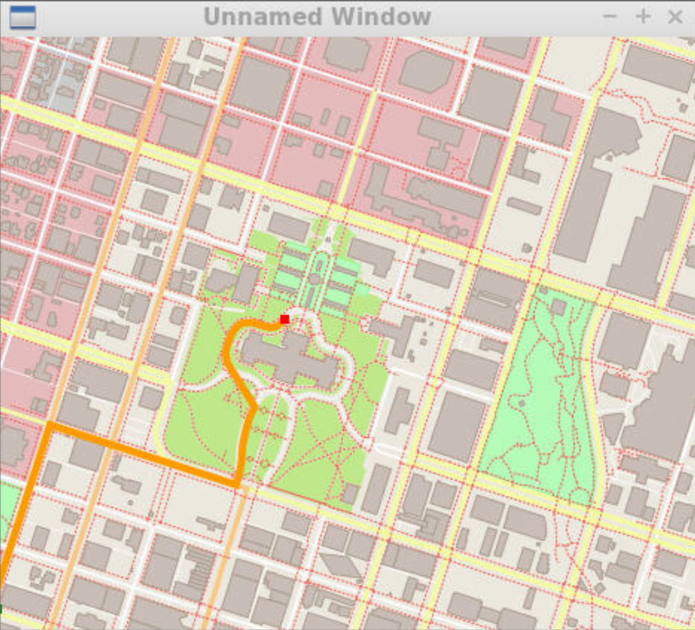
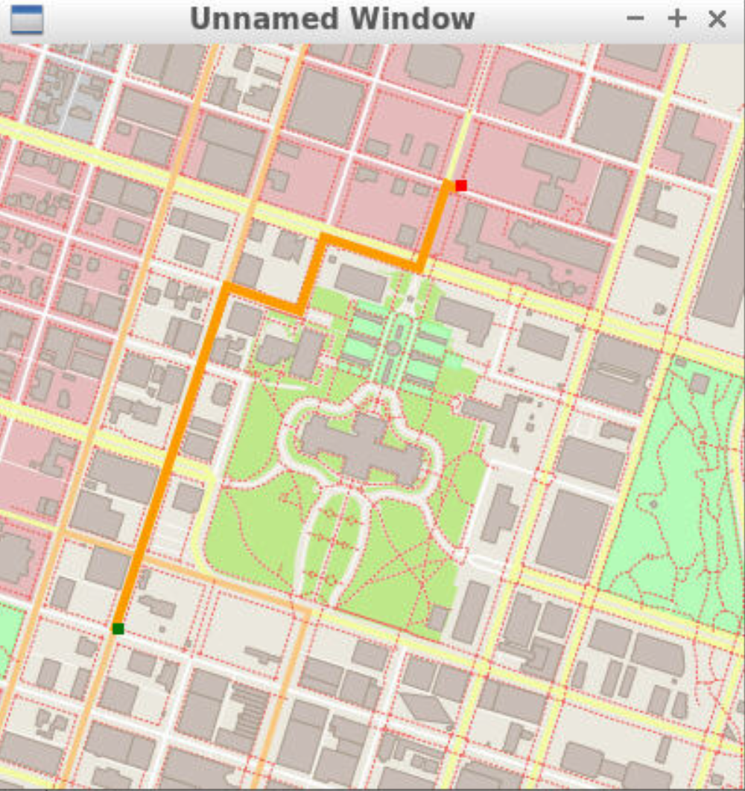

# Route Planning Project

This project contains the algorithms for planning the shortest path in a map using A* search. The map was derived from 
the OpenStreetMap API and it looks like the 
following:


This project is part of the curriculum developed by Udacity.
## Dependencies 
* cmake >= 3.11.3
  * All OSes: [click here for installation instructions](https://cmake.org/install/)
* make >= 4.1 (Linux, Mac), 3.81 (Windows)
  * Linux: make is installed by default on most Linux distros
  * Mac: [install Xcode command line tools to get make](https://developer.apple.com/xcode/features/)
  * Windows: [Click here for installation instructions](http://gnuwin32.sourceforge.net/packages/make.htm)
* gcc/g++ >= 7.4.0
  * Linux: gcc / g++ is installed by default on most Linux distros
  * Mac: same instructions as make - [install Xcode command line tools](https://developer.apple.com/xcode/features/)
  * Windows: recommend using [MinGW](http://www.mingw.org/)
* IO2D
  * Installation instructions for all operating systems can be found [here](https://github.com/cpp-io2d/P0267_RefImpl/blob/master/BUILDING.md)
  * This library must be built in a place where CMake `find_package` will be able to find it

## Compiling and Running

### Compiling
To compile the project, first, create a `build` directory and change to that directory:
```
mkdir build && cd build
```
From within the `build` directory, then run `cmake` and `make` as follows:
```
cmake ..
make
```
### Running
The executable will be placed in the `build` directory. From within `build`, you can run the project as follows:
```
./OSM_A_star_search
```
Or to specify a map file:
```
./OSM_A_star_search -f ../<your_osm_file.osm>
```

### Demo
Running the executable, you will be asked to specify the start position (start_x,start_y) and end position (end_x, end_y).
The coordinates are between 0 to 100 indicating the portion of the map. (0,0) corresponds to the bottom left corner and (100,100) 
corresponds to the top right corner.

The result after specifying inputs (0,0), (50, 50) look like the following:


The result after specifying inputs (20,20), (67, 84) look like the following:


  

